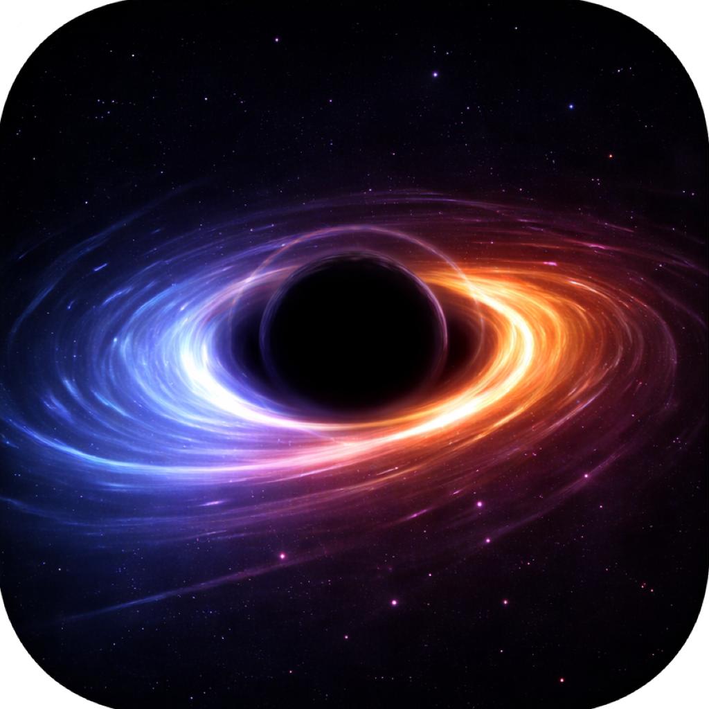

# Void Vortex

Een arcade-game voor de iPhone, gebouwd in Swift en SwiftUI.

## Over het spel

In Void Vortex draai je als ruimteschip rond een zwart gat. Met twee knoppen — PULL en PUSH — bepaal je hoe dicht je bij het zwarte gat komt. Ondertussen moet je steeds moeilijkere obstakels ontwijken: asteroïden, laserstralen, magnetische velden, vortexen en meer.

Het spel heeft 8 levels, 3 moeilijkheidsgraden en diverse power-ups zoals schilden, slow-motion en extra levens.

## Kenmerken

- **Unieke besturing** — draai automatisch in een baan rond het zwarte gat, stuur alleen je afstand
- **8 levels** met steeds nieuwe obstakels en uitdagingen
- **6 soorten obstakels** — asteroïden, orbiters, ringen, magnetische velden, vortexen en laserstralen
- **Power-ups** — schild, slow-motion, extra leven, puntenbonus
- **Procedurele geluidseffecten** — alle geluiden worden live gegenereerd, geen opgenomen samples
- **Haptische feedback** — trillingen bij botsingen en acties
- **Highscores** — je beste score en langste speeltijd worden bewaard

## Gebouwd met

| Technologie | Rol |
|---|---|
| **Swift** | Programmeertaal |
| **SwiftUI + Canvas** | Graphics en interface |
| **AVAudioEngine** | Procedurele geluidssynthese |
| **CADisplayLink** | Game loop (60-120 fps) |
| **Claude** (AI) | Assistentie bij het schrijven van de code |

Geen externe libraries of frameworks — volledig gebouwd met Apple's eigen tools.

## Vereisten

- macOS met Xcode
- iOS 17.0 of hoger
- Alleen portrait-modus (staand)

## Bouwen

1. Open `GravityWell.xcodeproj` in Xcode
2. Selecteer je iPhone of een simulator als doel
3. Druk op Build & Run (Cmd+R)

## Hoe het is gemaakt

Dit project is gebouwd als een samenwerking tussen mens en AI. Het idee en de creatieve keuzes kwamen van ons, de code is geschreven met hulp van Claude (een AI-assistent van Anthropic). We begonnen met een simpel webprototype om het speelconcept te testen, en hebben het daarna omgezet naar een volledige native iPhone-app.

## Licentie

Dit project is alleen bedoeld voor persoonlijk en educatief gebruik.
